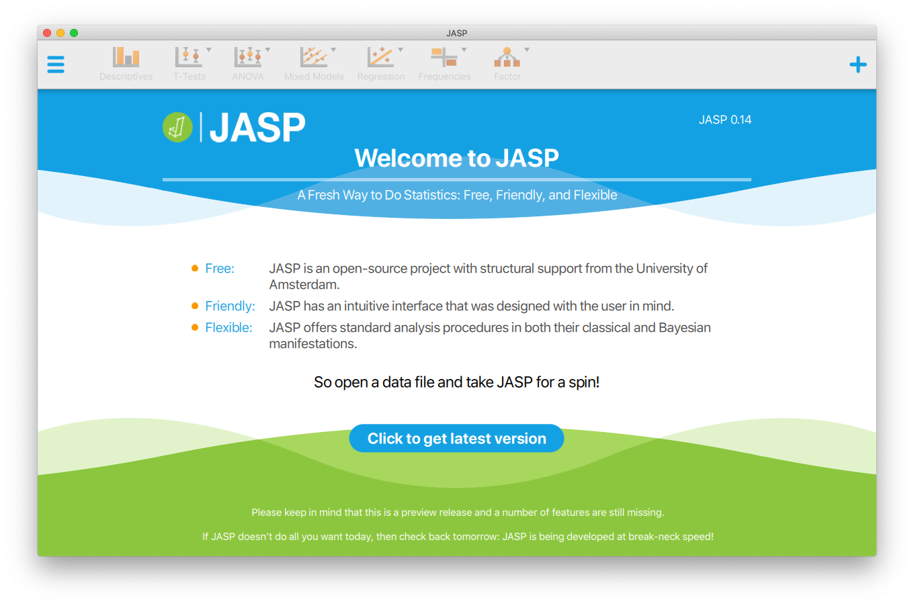
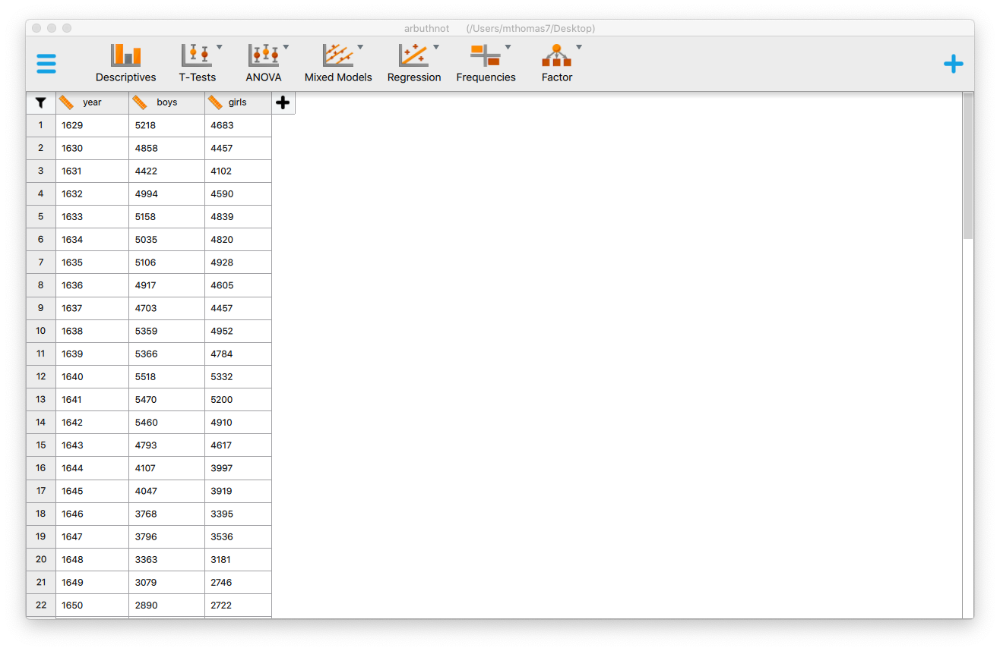

```{r global_options, include = FALSE}
knitr::opts_chunk$set(eval = TRUE, results = FALSE)
library(tidyverse)
library(openintro)
```

## The JASP Interface

The goal of this lab is to introduce you to JASP, which you'll be using throughout the course both to learn the statistical concepts discussed in the course and to analyze real data and come to informed conclusions.

As the labs progress, you are encouraged to explore beyond what the labs dictate; a willingness to experiment will make you a much better data analyst! Before we get to that stage, however, you need to build some basic fluency with JASP. First, we will explore the fundamental building blocks of JASP, reading in data, and basic commands for working with data in JASP.

You can download JASP from https://jasp-stats.org/. Click `download` near the top of the screen, then select the version from the computer you are using.

Go ahead and launch JASP You should see a window that looks like the image shown below.

```{r r-interface-2020, echo=FALSE, results="asis"}

```

### Loading data

First we're going to download a dataset. This data will be downloaded from https://www.openintro.org/data/index.php?data=arbuthnot. Open this window, then select the CSV file to download it to your computer. You may need to right click or control-click then select `save file as` in order to download the file instead of viewing it, depending on your operating system and particular web browser. Make sure to note where you download it, since we'll need to go to that location to load it.

To load the data, click the menu button at the top left part of the window (with the three horizontal lines), then `Open`, then `Computer`, then click `Browse`, and select the file in the location you downloaded it to. You will see a new window open with a display of the data, which should look like this:

```{r loaded-data, echo=FALSE, results="asis"}

```

You'll see three columns, one for each variable in the data. This display should feel similar to viewing data in Excel, where you are able to scroll through the dataset to inspect it. You can double click the data to open another editor to change any data that needs fixing, but we don't need to do that.

## Dr. Arbuthnot's Baptism Records

Let's take a peek at the data. The Arbuthnot data set refers to the work of Dr. John Arbuthnot, an 18<sup>th</sup> century physician, writer, and mathematician. He was interested in the ratio of newborn boys to newborn girls, so he gathered the baptism records for children born in London for every year from 1629 to 1710.

We can see that there are 82 observations and 3 variables in this dataset. The variable names are `year`, `boys`, and `girls`.

When inspecting the data, you should see three columns of numbers and 82 rows. Each row represents a different year that Arbuthnot collected data. There is also a column to the left of the variables which shows a row number. The first variable is the year, and the second and thirds are the numbers of boys and girls baptized that year, respectively. Use the scrollbar on the right side of the window to examine the complete data set.

Note that the row numbers are not part of Arbuthnot's data. JASP adds these row numbers as part of its printout to help you make visual comparisons. You can think of them as the index that you see on the left side of a spreadsheet. In fact, the comparison of the data to a spreadsheet will generally be helpful.

### Types of Variables

Just to the left of the name of each variable, you should see an icon of a ruler. If you click this icon, you will see three options. This allows you to specify whether JASP should interpret the varaible as a scale, ordinal, or nominal variable. JASP will try to select the correct type when it loads the data. We will leave these variables as scale.

## Some Exploration

Let's start to examine the data a little more closely. Click the `Descriptives` button near the top of the window. You will see the list of variables in one box. We can move the variable `boys` to the box labeled `Variables` to see some descriptive statistics for that variable. You can move the variable over by double clicking the variable name, by clicking and dragging the variable name, or by clicking the varaible name and then clicking the arrow between the boxes pointed at the `Variables` box.

You will then see the results in the right hand side of the window. You should see that there are 82 valid observations, no data is missing, and you will see various other descriptive statistics for that variable. You can add an additional variable to the `Variables` box, and you will then see descriptives for each variable in the box. Do this with `girls` to see how the two variables compare.

1.  How many valid oberservations are there for the variables `girls`? Are any values missing?

### Creating a JASP file

Now that we have some analysis, we should save our file in case we want to come back to it. With JASP, you can save a `.jasp` file which contains your data and all of your analysis, along with any descriptions you write in yourself. Open the menu, select `Save As` and you can save your first JASP file to your computer.

### Data visualization

In JASP, we can use the same descriptives section to generate graphics. To create a simple plot of the number of girls baptized per year, we will start by selecting the variables we are interested in. Move the variables so the `Variables` box contains `year` and `girls`. Next, click `Plots` below the boxes on the left hand side of the screen to see the plotting options. We'll make a scatter plot, so check the box next to `Scatter Plots`.

JASP adds a number of features to the scatter plot. By default, each variable is being plotted with a density, which is essentially a smoothed histograph. By clicking the radio buttons, you can change this to a hisogram, or turn it off. We can also include the regression line (which is turned on by default) or turn it off by unchecking the box next to `Add regression line`. Turning the graphs above and to the right of the scatter plot to `None` and turning off the regression line will produce a standard scatterplot.

JASP will use the variables in the variable box in order: the first variable will be on the x-axis and the second variable will be on the y-axis. Try switching the order of the variables by clicking and dragging them. See how your plot changes.

Use the plot to address the following question:

1.  Is there an apparent trend in the number of girls baptized over the years? How would you describe it?

## Analysis options

In the descriptives window, you can see four buttons. The first allows you to edit the title of the analysis. If you click this buttons, you can change `Descriptive Statistics` to a different name. If you click the `Descriptives` button again, you will see that you now have a second descriptive statistics box, and two descriptive statistics sections on the right hand side of the window. In this way, you can make a comprehensive list of all of your statistical work.

Next, the button with the plus sign allows you to duplicate an analysis, in case you want to run two similar analyses. Next, the button with the `i` provides information on the options in the window, and the `x` closes that particular analysis.

## Adding notes

We can now create lots of analyses, but we also want to provide written context and interpretations. Next to the title of a section, click the arrow, and select `Add Note`. You will see a text box at the beginning of the section and the end of the section, where you can add introductions and conclusions. Similarly, if you click the arrow next to the heading above a scatter plot, you can add a note to describe what is going on in the scatterplot.

### R as a big calculator

XXX CONTINUE


Now, suppose we want to plot the total number of baptisms. To compute this, we could use the fact that we can use `R` as a big calculator. To do this, we can type in mathematical expressions such as the below calculation into the console.

```{r calc-total-bapt-numbers}
5218 + 4683
```

This calculation would provide us with the total number of baptisms in 1629. We could then repeat this calculation once for each year. This would probably take us a while, but luckily there is a faster way! If we add the vector for baptisms for boys to that of girls, `R` can compute each of these sums simultaneously.

```{r calc-total-bapt-vars}
arbuthnot$boys + arbuthnot$girls
```

What you will see is a list of 82 numbers. These numbers appear as a list, because we are working with vectors rather than a data frame. Each number represents the sum of how many boys and girls were baptized that year. You can take a look at the first few rows of the `boys` and `girls` columns to see if the calculation is right.

### Adding a new variable to the data frame

We are interested in using this new vector of the total number of baptisms to generate some plots, so we'll want to save it as a permanent column in our data frame. We can do this using the following code:

```{r calc-total-bapt-vars-save}
arbuthnot <- arbuthnot %>%
  mutate(total = boys + girls)
```

This code has a lot of new pieces to it, so let's break it down. In the first line we are doing two things, (1) adding a new `total` column to this updated data frame, and (2) overwriting the existing `arbutnot` data frame with an updated data frame that includes the new `total` column. We are able to chain these two processes together using the **piping** (`%>%`) operator. The piping operator takes the output of the previous expression and "pipes it" into the first argument of the next expression.

To continue our analogy with mathematical functions, `x %>% f(y)` is equivalent to `f(x, y)`. Connecting `arbuthnot` and `mutate(total = boys + girls)` with the pipe operator is the same as typing `mutate(arbuthnot, total = boys + girls)`, where `arbuthnot` becomes the first argument included in the `mutate()` function.

::: {#boxedtext}
**A note on piping:** Note that we can read these two lines of code as the following:

*"Take the `arbuthnot` dataset and **pipe** it into the `mutate` function. Mutate the `arbuthnot` data set by creating a new variable called `total` that is the sum of the variables called `boys` and `girls`. Then assign the resulting dataset to the object called `arbuthnot`, i.e. overwrite the old `arbuthnot` dataset with the new one containing the new variable."*

This is equivalent to going through each row and adding up the `boys` and `girls` counts for that year and recording that value in a new column called `total`.
:::

<div>

**Where is the new variable?** When you make changes to variables in your dataset, click on the name of the dataset again to update it in the data viewer.

</div>

You'll see that there is now a new column called `total` that has been tacked onto the data frame. The special symbol `<-` performs an *assignment*, taking the output of the piping operations and saving it into an object in your environment. In this case, you already have an object called `arbuthnot` in your environment, so this command updates that data set with the new mutated column.

You can make a line plot of the total number of baptisms per year with the following code:

```{r plot-total-vs-year}
ggplot(data = arbuthnot, aes(x = year, y = total)) + 
  geom_line()
```

In an similar fashion, once you know the total number of baptisms for boys and girls in 1629, you can compute the ratio of the number of boys to the number of girls baptized with the following code:

```{r calc-prop-boys-to-girls-numbers}
5218 / 4683
```

Alternatively, you could calculate this ratio for every year by acting on the complete `boys` and `girls` columns, and then save those calculations into a new variable named `boy_to_girl_ratio`:

```{r calc-prop-boys-to-girls-vars}
arbuthnot <- arbuthnot %>%
  mutate(boy_to_girl_ratio = boys / girls)
```

You can also compute the proportion of newborns that are boys in 1629 with the following code:

```{r calc-prop-boys-numbers}
5218 / (5218 + 4683)
```

Or you can compute this for all years simultaneously and add it as a new variable named `boy_ratio` to the dataset:

```{r calc-prop-boys-vars}
arbuthnot <- arbuthnot %>%
  mutate(boy_ratio = boys / total)
```

Notice that rather than dividing by `boys + girls` we are using the `total` variable we created earlier in our calculations!

3.  Now, generate a plot of the proportion of boys born over time. What do you see?

<div>

**Tip:** If you use the up and down arrow keys in the console, you can scroll through your previous commands, your so-called command history. You can also access your command history by clicking on the history tab in the upper right panel. This can save you a lot of typing in the future.

</div>

Finally, in addition to simple mathematical operators like subtraction and division, you can ask R to make comparisons like greater than, `>`, less than, `<`, and equality, `==`. For example, we can create a new variable called `more_boys` that tells us whether the number of births of boys outnumbered that of girls in each year with the following code:

```{r boys-more-than-girls}
arbuthnot <- arbuthnot %>%
  mutate(more_boys = boys > girls)
```

This command adds a new variable to the `arbuthnot` data frame containing the values of either `TRUE` if that year had more boys than girls, or `FALSE` if that year did not (the answer may surprise you). This variable contains a different kind of data than we have encountered so far. All other columns in the `arbuthnot` data frame have values that are numerical (the year, the number of boys and girls). Here, we've asked R to create *logical* data, data where the values are either `TRUE` or `FALSE`. In general, data analysis will involve many different kinds of data types, and one reason for using `R` is that it is able to represent and compute with many of them.

## More Practice

In the previous few pages, you recreated some of the displays and preliminary analysis of Arbuthnot's baptism data. Your assignment involves repeating these steps, but for present day birth records in the United States. The data are stored in a data frame called `present`.

To find the minimum and maximum values of columns, you can use the functions `min()` and `max()` within a `summarize()` call, which you will learn more about in the following lab.

Here's an example of how to find the minimum and maximum amount of boy births in a year:

```{r summarize min and max}
arbuthnot %>%
  summarize(min = min(boys),
            max = max(boys)
            )
```

Answer the following questions with the `present` data frame:

1.  What years are included in this data set? What are the dimensions of the data frame? What are the variable (column) names?

2.  How do these counts compare to Arbuthnot's? Are they of a similar magnitude?

3.  Make a plot that displays the proportion of boys born over time. What do you see? Does Arbuthnot's observation about boys being born in greater proportion than girls hold up in the U.S.? Include the plot in your response. *Hint:* You should be able to reuse your code from Exercise 3 above, just replace the name of the data frame.

4.  In what year did we see the most total number of births in the U.S.? *Hint:* First calculate the totals and save it as a new variable. Then, sort your dataset in descending order based on the `total` column. You can do this interactively in the data viewer by clicking on the arrows next to the variable names. To include the sorted result in your report you will need to use two new functions. First we use `arrange()` to sorting the variable. Then we can arrange the data in a descending order with another function, `desc()`, for descending order. The sample code is provided below.

```{r sample-arrange, eval=FALSE}
present %>%
  arrange(desc(total))
```

These data come from reports by the Centers for Disease Control. You can learn more about them by bringing up the help file using the command `?present`.

## Resources for learning R and working in RStudio

That was a short introduction to R and RStudio, but we will provide you with more functions and a more complete sense of the language as the course progresses.

In this course we will be using the suite of R packages from the **tidyverse**. The book [R For Data Science](https://r4ds.had.co.nz/) by Grolemund and Wickham is a fantastic resource for data analysis in R with the tidyverse. If you are Goggling for R code, make sure to also include these package names in your search query. For example, instead of Goggling "scatterplot in R", Goggle "scatterplot in R with the tidyverse".

These may come in handy throughout the semester:

-   [RMarkdown cheatsheet](https://github.com/rstudio/cheatsheets/raw/master/rmarkdown-2.0.pdf)
-   [Data transformation cheatsheet](https://github.com/rstudio/cheatsheets/raw/master/data-transformation.pdf)
-   [Data visualization cheatsheet](https://github.com/rstudio/cheatsheets/raw/master/data-visualization-2.1.pdf)

Note that some of the code on these cheatsheets may be too advanced for this course. However the majority of it will become useful throughout the semester.

------------------------------------------------------------------------

<a rel="license" href="http://creativecommons.org/licenses/by-sa/4.0/">{style="border-width:0"}</a><br />This work is licensed under a <a rel="license" href="http://creativecommons.org/licenses/by-sa/4.0/">Creative Commons Attribution-ShareAlike 4.0 International License</a>.
